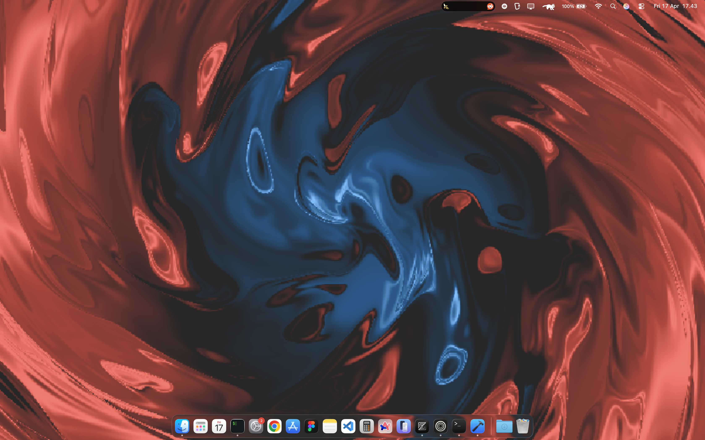
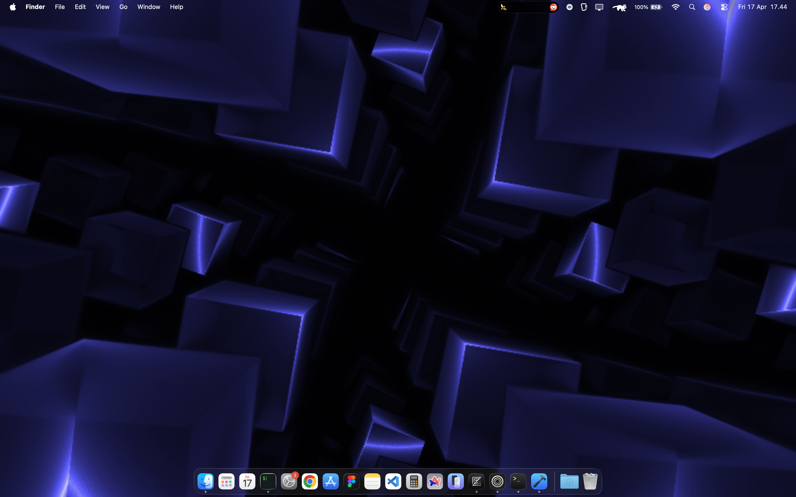
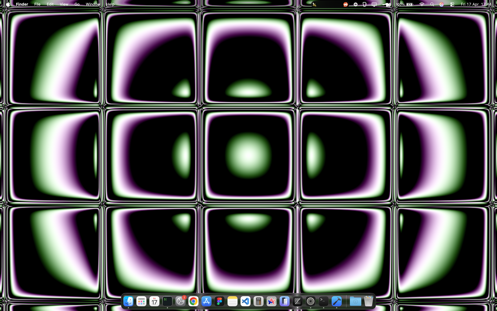
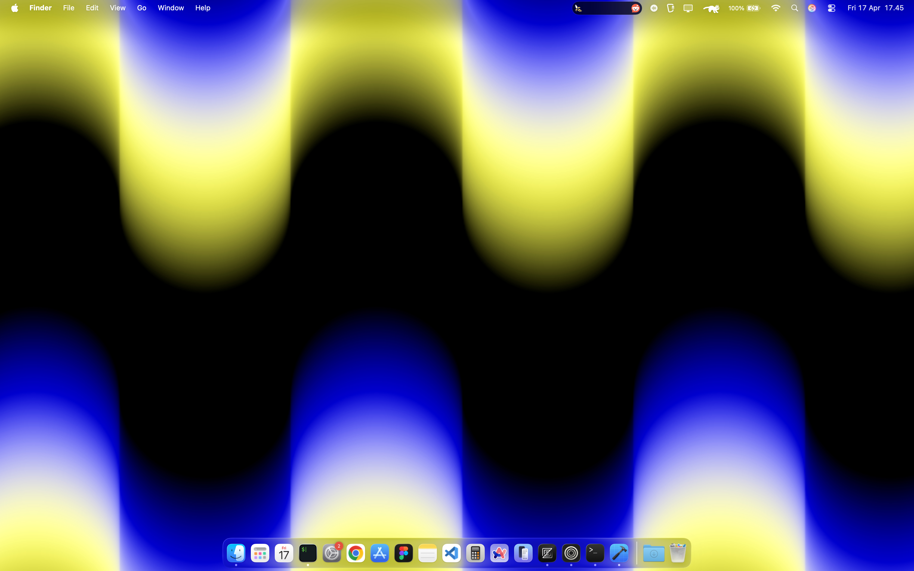
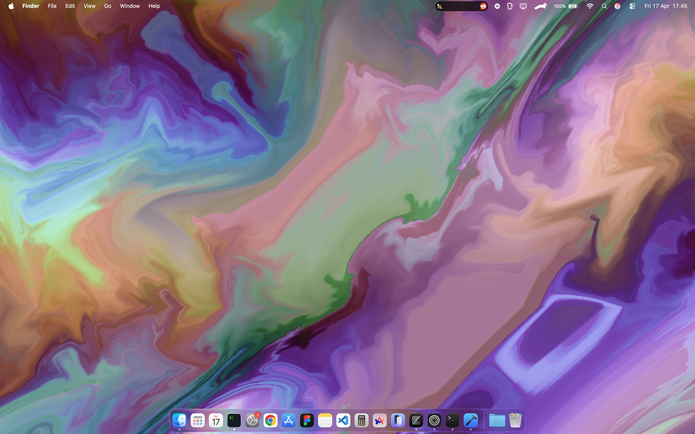
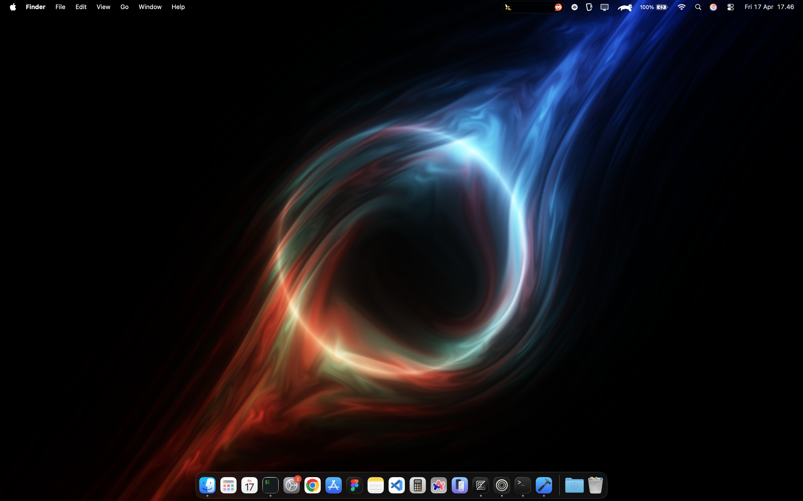
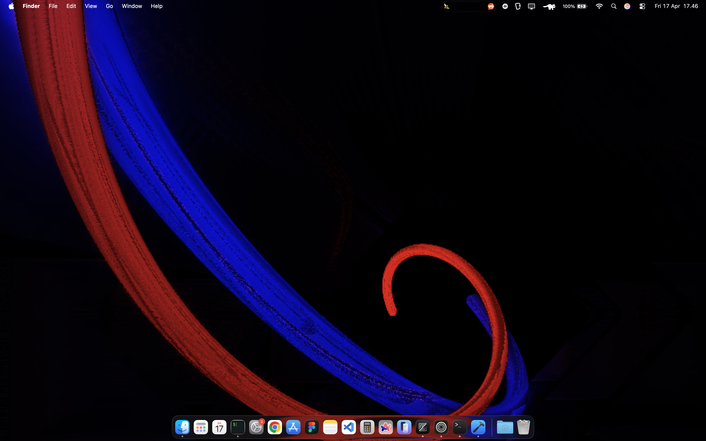
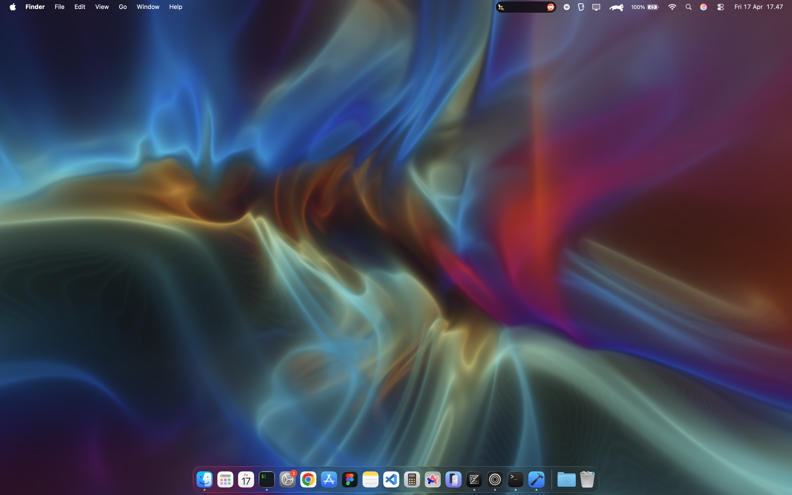

# ShaderWallpaper for macOS

A beautiful, GPU-accelerated live wallpaper for macOS with multiple shader effects and easy menu bar controls.


## ✨ Features

- 🎨 **8 Built-in Shaders**: Switch between stunning visual effects
- 🖱️ **Menu Bar Control** - Easy access to all features
- 👁️ **Hide/Show Toggle** - Temporarily disable the wallpaper
- ⚡ **GPU Accelerated** - Smooth 60 FPS using Metal
- 🔋 **Efficient** - Minimal CPU usage, runs at desktop level
- 🚀 **Auto-start** - Optional launch on login

## 🎨 Available Shaders

| Shader | Preview | Description | Source |
|--------|---------|-------------|--------|
| Balatro (Original) |  | Swirling abstract art with rich colors and smooth animations | [ShaderToy](https://www.shadertoy.com/view/XXtBRr) |
| Multi Box |  | Animated geometric boxes with dynamic patterns | Custom |
| Tiles |  | Colorful tile patterns with flowing transitions | Custom |
| Pillars |  | Vertical pillar structures with wave motion | Custom |
| Marbles |  | Marble-like swirls and patterns | Custom |
| Black Hole |  | Cosmic black hole effect with gravitational distortion | Custom |
| Shiny Color |  | Vibrant shiny color gradients | Custom |
| Heavenly |  | Ethereal heavenly glow effects | Custom |

## 📥 Installation

### Download

1. Go to [Releases](../../releases/latest)
2. Download either:
   - `ShaderWallpaper-v*.dmg` (recommended)
   - `ShaderWallpaper-v*.zip`

### Install

**From DMG:**
1. Open the downloaded DMG file
2. Drag `ShaderWallpaper.app` to your Applications folder
3. Launch from Applications

**From ZIP:**
1. Extract the ZIP file
2. Move `ShaderWallpaper.app` to Applications folder
3. Right-click the app and select "Open" (first time only)

### Auto-start on Login (Optional)

1. Open **System Settings**
2. Go to **General → Login Items**
3. Click the **+** button
4. Select **ShaderWallpaper** from Applications
5. Click **Add**

## 🎮 Usage

### Menu Bar Controls

Look for the **waveform icon** (≋) in your menu bar:

- **Hide/Show Wallpaper** - Toggle visibility (⌘H)
- **Select Shader** - Choose from 8 different effects
- **Quit** - Exit the application (⌘Q)

### Keyboard Shortcuts

- `⌘H` - Hide/Show wallpaper
- `⌘Q` - Quit application

## 🛠️ Building from Source

### Requirements

- macOS 13.0 or later
- Xcode 16.2 or later
- Swift 5.9+

### Build Steps

```bash
# Clone the repository
git clone https://github.com/xxidbr9/ShaderWallpaper.git
cd ShaderWallpaper

# Open in Xcode
open ShaderWallpaper.xcodeproj

# Build and run (⌘R)
```

### Project Structure

```
ShaderWallpaper/
├── ShaderWallpaper.swift    # Main app entry point
├── ShaderRenderer.swift    # Metal rendering and menu bar logic
├── Shaders/
│   ├── vertex.metal         # Vertex shader
│   ├── common.metal         # Shared functions
│   ├── balatro.metal        # Balatro shader
│   ├── multibox.metal       # Multi Box shader
│   ├── tile.metal           # Tiles shader
│   ├── pilar.metal          # Pillars shader
│   ├── marbel.metal         # Marbles shader
│   ├── blackHoles.metal     # Black Hole shader
│   ├── shiny.metal          # Shiny Color shader
│   └── heavenly.metal       # Heavenly shader
└── Info.plist              # App configuration
```

## 🎯 Adding Custom Shaders

Want to add your own shaders? Here's how:

1. **Add shader type** in `ShaderRenderer.swift`:
```swift
enum ShaderType: String, CaseIterable {
    case myShader = "My Custom Shader"
    // Add case to shaderName switch...
}
```

2. **Create shader file** in `Shaders/myShader.metal`:
```metal
#include <metal_stdlib>
#include "common.metal"
#include "vertex.metal"

fragment float4 myShader(VertexOut in [[stage_in]],
                         constant Uniforms &uniforms [[buffer(0)]]) {
    float2 uv = in.texCoord;
    // Your shader code here
    return float4(color, 1.0);
}
```

3. **Update ShaderRenderer.swift** to include your shader:
   - Add `case myShader: return "myShader"` in the `shaderName` switch
   - Add `.myShader` to the CaseIterable enum if needed

4. Rebuild and enjoy your custom effect!

## 🐛 Troubleshooting

### App won't open
- Right-click the app and select "Open" (first time only)
- Go to System Settings → Privacy & Security and allow the app

### Wallpaper not showing
- Click the menu bar icon and ensure it's not hidden
- Check that no other wallpaper apps are running

### Performance issues
- Reduce FPS in code: change `preferredFramesPerSecond` to 30
- Close other GPU-intensive applications

## 📄 License

MIT License - feel free to use, modify, and distribute!

## 🙏 Credits

- Original Balatro shader by [localthunk](https://www.playbalatro.com)
- Built with Metal and Swift
- Thanks to ShaderToy community

## 🤝 Contributing

Contributions are welcome! Feel free to:
- Add new shaders
- Improve performance
- Fix bugs
- Enhance documentation

## 📮 Support

Found a bug or have a feature request? [Open an issue](../../issues)!

---

Made with ❤️ for macOS
