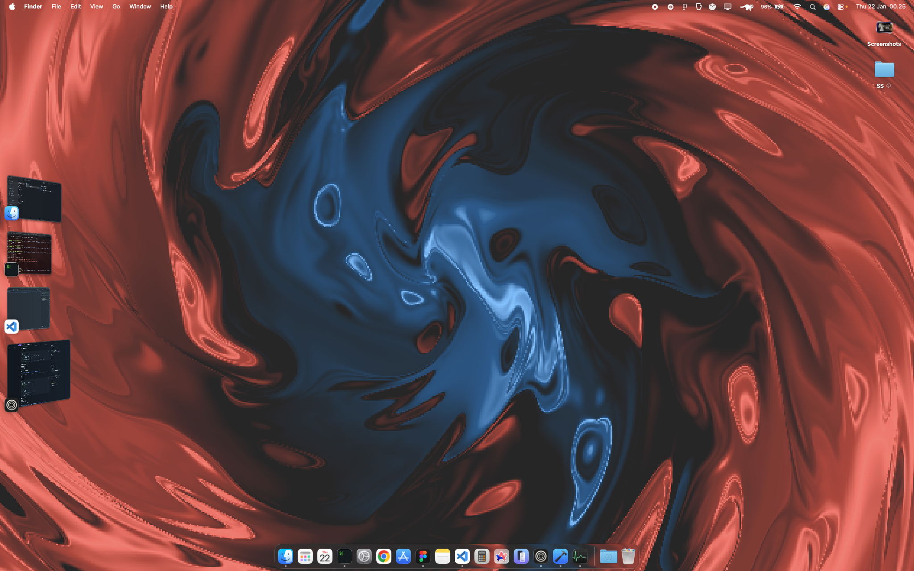

# ShaderWallpaper for macOS

A beautiful, GPU-accelerated live wallpaper for macOS with multiple shader effects and easy menu bar controls.



## ✨ Features

- 🎨 **1 Built-in Shaders**: Switch between stunning visual effects
  - **Balatro** - Original swirling abstract art (by [localthunk](https://www.playbalatro.com))
  - **SOON** - Any other shader port will be soon updated

- 🖱️ **Menu Bar Control** - Easy access to all features
- 👁️ **Hide/Show Toggle** - Temporarily disable the wallpaper
- ⚡ **GPU Accelerated** - Smooth 60 FPS using Metal
- 🔋 **Efficient** - Minimal CPU usage, runs at desktop level
- 🚀 **Auto-start** - Optional launch on login

## 📥 Installation

### Download

1. Go to [Releases](../../releases/latest)
2. Download either:
   - `ShaderWallpaper-v*.dmg` (recommended)
   - `ShaderWallpaper-v*.zip`

### Install

**From DMG:**
1. Open the downloaded DMG file
2. Drag `ShaderWallpaper.app` to your Applications folder
3. Launch from Applications

**From ZIP:**
1. Extract the ZIP file
2. Move `ShaderWallpaper.app` to Applications folder
3. Right-click the app and select "Open" (first time only)

### Auto-start on Login (Optional)

1. Open **System Settings**
2. Go to **General → Login Items**
3. Click the **+** button
4. Select **ShaderWallpaper** from Applications
5. Click **Add**

## 🎮 Usage

### Menu Bar Controls

Look for the **waveform icon** (≋) in your menu bar:

- **Hide/Show Wallpaper** - Toggle visibility (⌘H)
- **Select Shader** - Choose from 4 different effects
- **Quit** - Exit the application (⌘Q)

### Keyboard Shortcuts

- `⌘H` - Hide/Show wallpaper
- `⌘Q` - Quit application

## 🎨 Shader Previews

### Balatro (Original)
Swirling abstract art with rich colors and smooth animations, from my own port ShaderToys:

[https://www.shadertoy.com/view/XXtBRr](https://www.shadertoy.com/view/XXtBRr)

### Soon
Any other shaders port will soon be implemented.


## 🛠️ Building from Source

### Requirements

- macOS 13.0 or later
- Xcode 16.2 or later
- Swift 5.9+

### Build Steps

```bash
# Clone the repository
git clone https://github.com/xxidbr9/ShaderWallpaper.git
cd ShaderWallpaper

# Open in Xcode
open ShaderWallpaper.xcodeproj

# Build and run (⌘R)
```

### Project Structure

```
ShaderWallpaper/
├── ShaderWallpaper.swift    # Main app logic and menu bar
├── Shader.metal             # Metal shaders
└── Info.plist              # App configuration
```

## 🎯 Adding Custom Shaders

Want to add your own shaders? Here's how:

1. **Add shader type** in `ShaderWallpaper.swift`:
```swift
enum ShaderType: String, CaseIterable {
    case myShader = "My Custom Shader"
    // ...
}
```

2. **Write shader code** in `Shader.metal`:
```metal
fragment float4 myShader(VertexOut in [[stage_in]],
                         constant float *uniforms [[buffer(0)]]) {
    float iTime = uniforms[0];
    float2 iResolution = float2(uniforms[1], uniforms[2]);
    // Your shader code here
    return float4(color, 1.0);
}
```

3. Rebuild and enjoy your custom effect!

## 🐛 Troubleshooting

### App won't open
- Right-click the app and select "Open" (first time only)
- Go to System Settings → Privacy & Security and allow the app

### Wallpaper not showing
- Click the menu bar icon and ensure it's not hidden
- Check that no other wallpaper apps are running

### Performance issues
- Reduce FPS in code: change `preferredFramesPerSecond` to 30
- Close other GPU-intensive applications

## 📄 License

MIT License - feel free to use, modify, and distribute!

## 🙏 Credits

- Original Balatro shader by [localthunk](https://www.playbalatro.com)
- Built with Metal and Swift
- Thanks to ShaderToy community

## 🤝 Contributing

Contributions are welcome! Feel free to:
- Add new shaders
- Improve performance
- Fix bugs
- Enhance documentation

## 📮 Support

Found a bug or have a feature request? [Open an issue](../../issues)!

---

Made with ❤️ for macOS